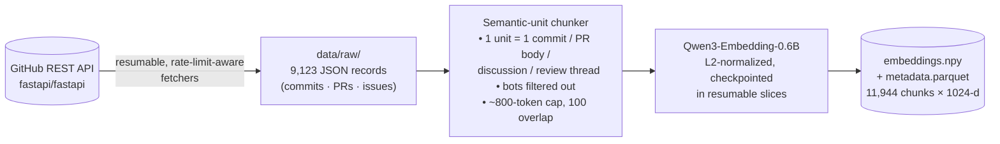
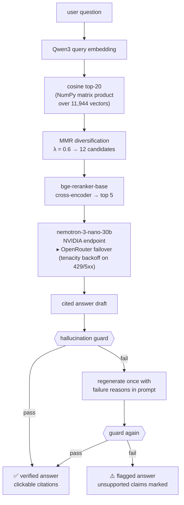

# PatchContext

[](https://www.python.org/)
[](LICENSE)
[](https://github.com/sairamsrujan/PatchContext/actions/workflows/tests.yml)

**Ask *why* FastAPI is designed the way it is — and get answers backed by the
actual commits, pull requests, and issues where those decisions happened.**

PatchContext is a Retrieval-Augmented Generation (RAG) system built over 3.5
years of [fastapi/fastapi](https://github.com/fastapi/fastapi) development
history. Every answer carries inline citations (`[PR #11522]`,
`[commit ab12cd3]`) that link to the real GitHub pages, and every answer must
pass a two-stage **hallucination guard** before it is shown.

**▶ Live demo:** https://patchcontext-104976457352.us-central1.run.app
*(scales to zero when idle — the first visit takes ~1–2 minutes while models
load, after which queries run normally)*

---

## Table of contents

- [Why this exists](#why-this-exists)
- [How it works](#how-it-works)
  - [Offline: building the index](#offline-building-the-index)
  - [Online: answering a question](#online-answering-a-question)
  - [The hallucination guard](#the-hallucination-guard)
- [Tech stack](#tech-stack)
- [Evaluation](#evaluation)
- [Getting started](#getting-started)
- [Configuration](#configuration)
- [Rebuilding the index](#rebuilding-the-index)
- [Deployment](#deployment)
- [Design decisions & trade-offs](#design-decisions--trade-offs)
- [Limitations](#limitations)
- [Repository layout](#repository-layout)

## Why this exists

The reasoning behind a framework's design rarely lives in its documentation.
It lives in years-old pull-request reviews, issue threads, and commit messages
— for example, *why* FastAPI replaced `startup`/`shutdown` events with
`lifespan`, or what actually happened when Pydantic v2 landed. Digging that up
by hand means searching thousands of threads.

An LLM asked the same question will happily answer — and just as happily
invent a PR number that never existed. That failure mode is the real problem
this project attacks: **every factual claim must be traceable to a real,
verifiable source, and unsupported claims must be caught before the user sees
them.**

## How it works

### Offline: building the index



Three fetchers pull commits (message + per-file stats), PRs (body + review
threads + linked issues), and issues (body + comment threads) through an
authenticated client that respects GitHub's rate limits, checkpoints its
pagination, and caches one JSON file per record — so an interrupted run
resumes instead of restarting. The chunker keeps one semantic unit per chunk
(never merging unrelated content), attaches full metadata
(`source_type, ref_id, url, author, date, title, section`), and drops bot
noise (release bots, CI comments) that would pollute retrieval.

### Online: answering a question



Retrieval casts a wide net (top-20 by cosine), de-duplicates it (MMR keeps
relevant-but-diverse candidates, since one PR often produces several
near-identical chunks), then applies a cross-encoder for precise
query–document scoring of the final 5 chunks the LLM sees. The generation
prompt demands one claim per sentence in a fixed citation format, and permits
refusal: *"the retrieved history does not contain the answer"* is a valid
response, not a failure.

### The hallucination guard

Two independent checks run on every generated answer:

| Stage | Check | Catches |
|-------|-------|---------|
| **1. Reference validator** (deterministic) | Every cited `[PR #N]` / `[Issue #N]` / `[commit sha]` is regex-extracted and looked up in the index metadata. Type-aware: citing a real PR number as an *Issue* also fails. | Invented references — the classic RAG failure |
| **2. NLI entailment** (model-based) | Each *cited sentence* must be entailed (p > 0.5) by at least one retrieved chunk, scored by `nli-deberta-v3-base` over 60-word premise windows. | Real citations attached to claims the source doesn't actually support |

On failure the pipeline regenerates once, feeding the specific unsupported
claims back into the prompt. If the second attempt still fails, the answer is
shown **flagged**, with the unsupported sentences visibly marked — the system
never silently presents unverified content.

The guard is measurably calibrated, not just wired up: on known-true vs
deliberately invented claims, the entailment scores separate cleanly
(true ≥ 0.95, invented ≤ 0.01) at the 60-word premise window size — larger
windows lost that separation because the NLI model truncates long inputs.

## Tech stack

| Layer | Choice | Notes |
|-------|--------|-------|
| Ingestion | GitHub REST API via `httpx` | authenticated, resumable, rate-limit-aware |
| Embeddings | `Qwen/Qwen3-Embedding-0.6B` | in-process CPU, L2-normalized, 1024-d |
| Vector search | NumPy cosine + MMR | see [design decisions](#design-decisions--trade-offs) for why not FAISS at serving time |
| Reranker | `BAAI/bge-reranker-base` | cross-encoder over (query, chunk) pairs |
| LLM | `nvidia/nemotron-3-nano-30b-a3b` | OpenAI-compatible client; NVIDIA primary, OpenRouter `:free` automatic failover |
| Guard | `cross-encoder/nli-deberta-v3-base` + regex validation | entailment threshold 0.5 |
| UI | Streamlit | chat, clickable citations, guard badges, retrieval expander, evaluation tab |
| Evaluation | RAGAs, Gemini judge | 50-question benchmark |
| Tests | pytest — 70 tests | all pipeline stages covered offline (no model downloads needed) |

The LLM layer is fully provider-agnostic: `base_url` / `api_key` / `model`
come from environment variables, so the same code runs against any
OpenAI-compatible endpoint. Total running cost is **zero** — local models on
CPU, free-tier LLM endpoints.

## Evaluation

A 50-question benchmark was authored against the corpus — every referenced
PR/issue/commit verified to exist in the index, with merge status checked:

- **30 direct** questions (single source answers them)
- **15 multi-hop** questions (require connecting a PR to its motivating issue,
  or a bug report to its fix)
- **5 unanswerable** questions (false premises — the correct answer is a refusal)

Scored with RAGAs using a Gemini judge
(full run: [`src/patchcontext/eval/results/`](src/patchcontext/eval/results/)):

| Metric | Score |
|--------|------:|
| Faithfulness | **0.909** |
| Answer relevancy | **0.739** (0.822 answerable-only) |
| Context precision | **0.875** |
| Context recall | **1.000** |

**Reading the weakest number honestly:** answer relevancy (0.739) is dragged
down by the 5 unanswerable questions — the system *correctly refuses* them,
and RAGAs scores every refusal 0.0 by design. Restricted to the 45 answerable
questions it is **0.822** (direct 0.834, multi-hop 0.797). Perfect context
recall confirms retrieval finds the evidence; high faithfulness confirms
answers stay grounded in it.

## Getting started

Prerequisites: Python 3.11 and ~4 GB of free RAM (three transformer models
load in-process). First run downloads ~2.4 GB of model weights (cached after).

```bash
git clone https://github.com/sairamsrujan/PatchContext.git
cd PatchContext

# environment (uv shown; plain venv+pip works too)
uv venv --python 3.11 .venv && source .venv/bin/activate
uv pip install -r requirements.txt -e .

# macOS only — make torch and faiss share one OpenMP runtime (see script header)
python scripts/fix_macos_libomp.py

# keys: copy the template and fill in what you have
cp .env.example .env

pytest                # 70 tests, no network or model downloads needed
streamlit run app.py  # the index ships with the repo, so this just works
```

The chat needs at least one LLM key in `.env` (`LLM_API_KEY`); everything
else — retrieval, the evaluation tab, tests — works without any keys.

## Configuration

All settings live in [`src/patchcontext/config.py`](src/patchcontext/config.py)
(pydantic-settings) and can be overridden via environment or `.env`:

| Variable | Default | Purpose |
|----------|---------|---------|
| `LLM_API_KEY` | — | primary LLM endpoint key (NVIDIA `nvapi-…`) |
| `LLM_FALLBACK_API_KEY` | — | failover endpoint key (OpenRouter `sk-or-…`) |
| `LLM_BASE_URL` / `LLM_MODEL` | NVIDIA / nemotron | swap to any OpenAI-compatible provider |
| `GITHUB_TOKEN` | — | only needed to rebuild the index |
| `MODEL_DEVICE` | `cpu` | `mps` on Apple Silicon for faster local inference |
| `NLI_THRESHOLD` | `0.5` | guard entailment threshold |
| `RETRIEVAL_TOP_K` / `MMR_LAMBDA` / `RERANK_TOP_K` | 20 / 0.6 / 5 | retrieval funnel shape |
| `RAGAS_JUDGE_API_KEY` | — | only needed to re-run the evaluation |

## Rebuilding the index

The committed index covers 2023-01-02 → 2026-07-10. To rebuild or extend it:

```bash
python scripts/run_ingestion.py                     # full pipeline: fetch → chunk → embed → index
python scripts/run_ingestion.py --since 2024-01-01  # custom window
python scripts/run_ingestion.py --skip-fetch        # re-chunk/re-embed the cached raw data
```

Ingestion is resumable end-to-end: fetchers checkpoint pagination and cache
per-record files; embedding saves progress in token-budgeted slices, so an
interrupted multi-hour run continues where it stopped. A full rebuild makes
~12k API requests (the client sleeps through rate-limit windows automatically)
and embeds ~12k chunks.

## Deployment

The live instance runs on **Google Cloud Run** (2 vCPU / 8 GiB, scales to zero
when idle, so it costs nothing between uses). The
[`Dockerfile`](Dockerfile) builds a fully self-contained image — index and all
three models baked in, no runtime downloads:

```bash
docker build -t patchcontext .
docker run -p 8501:8501 --env-file .env patchcontext
```

`./scripts/deploy_cloudrun.sh` automates the Cloud Run deployment (one-time
`gcloud auth` steps in the script header). Anything with ≥ 4 GB RAM can host
the same image.

## Design decisions & trade-offs

Choices that shaped the project, and why:

- **NumPy instead of FAISS at serving time.** The corpus is ~12k vectors, so
  exact cosine search is a single 12k×1024 matrix–vector product —
  microseconds. FAISS added no speed at this scale but did add a real
  production bug: on x86-64 Linux, FAISS and PyTorch each bundle their own
  OpenMP runtime, and the duplicate runtimes caused intermittent segfaults in
  the container. Removing FAISS from the serving path (it is still used to
  build the offline index) fixed the crash *and* let torch inference run
  multi-threaded again. Verified: NumPy returns byte-identical rankings.
- **MMR before the reranker.** One busy PR yields several near-identical
  chunks that would monopolize the top-20. MMR (λ=0.6) keeps the candidate
  set relevant *and* diverse before the expensive cross-encoder runs.
- **A reasoning LLM needs different plumbing.** nemotron-3-nano thinks before
  it answers. A tight `max_tokens` truncated it mid-reasoning and leaked
  chain-of-thought into answers; the client now allots reasoning headroom,
  strips `<think>` blocks, and discards truncated generations
  (`finish_reason=length`) with a doubled-budget retry.
- **Two guard stages, not one.** Regex reference validation is cheap,
  deterministic, and catches invented citations outright; NLI entailment
  catches the subtler failure of real citations attached to unsupported
  claims. Each catches what the other cannot.
- **Refusals are first-class.** The prompt explicitly allows "the history
  does not contain this," and the benchmark includes unanswerable questions
  to verify the system actually refuses instead of confabulating — even
  though that decision visibly costs benchmark points on answer relevancy.
- **Bot filtering at chunk time.** ~950 release-bot commits and ~320
  dependency-bump PRs carried zero design history but would have dominated
  retrieval for many queries.
- **Models baked into the Docker image.** Cold starts on scale-to-zero
  hosting would otherwise re-download 2.4 GB of weights per wake-up. The
  image is bigger, but first-request latency drops from "minutes of
  downloading" to "seconds of loading from disk."

## Limitations

- **Cold starts.** On the free scale-to-zero tier, the first request after
  idle takes ~1–2 minutes while models load into memory. Subsequent queries
  run normally (~30–90 s each, dominated by the LLM call and guard checks).
- **Corpus window.** Knowledge is bounded by the indexed window (2023-01 →
  2026-07). Questions about earlier design history (e.g. FastAPI's 2018–2019
  origins) are correctly refused rather than answered.
- **Free-tier LLM endpoints** are rate-limited; the failover mitigates but
  cannot eliminate provider throttling under sustained load.
- **NLI guard granularity.** Entailment is checked per sentence; a sentence
  that summarizes across several chunks can be flagged even when its parts
  are individually supported. The flag is conservative by design — false
  ⚠️ flags are preferred over silent hallucinations.

## Repository layout

```
app.py                       Streamlit UI (chat, citations, guard badges, eval tab)
src/patchcontext/
  config.py                  all settings & env vars (pydantic-settings)
  pipeline.py                retrieve → rerank → generate → guard orchestration
  ingest/
    github_client.py         authenticated, resumable, rate-limit-aware client
    fetch_commits.py         commits: message + per-file stats
    fetch_prs.py             PRs: body + review threads + linked issues
    fetch_issues.py          issues: body + comment threads
  index/
    chunker.py               semantic-unit chunking, bot filtering, metadata
    embedder.py              Qwen3 batch embedding (lazy-loaded singleton)
    build_index.py           checkpointed embedding + index artifacts
  retrieve/
    retriever.py             NumPy cosine search + MMR
    reranker.py              bge-reranker cross-encoder
  generate/
    llm_client.py            provider-agnostic client with failover + retries
    prompts.py               system prompt, citation format, regeneration prompt
  guard/
    ref_validator.py         deterministic citation-existence check
    nli_guard.py             per-sentence NLI entailment check
  eval/
    benchmark.jsonl          50 corpus-verified questions
    run_ragas.py             batched, resumable RAGAs runner
    results/                 committed evaluation output
scripts/                     ingestion, smoke test, deploy, local helpers
tests/                       70 pytest tests (all offline)
data/index/                  committed index: embeddings.npy + metadata.parquet
```

## License

[MIT](LICENSE)
